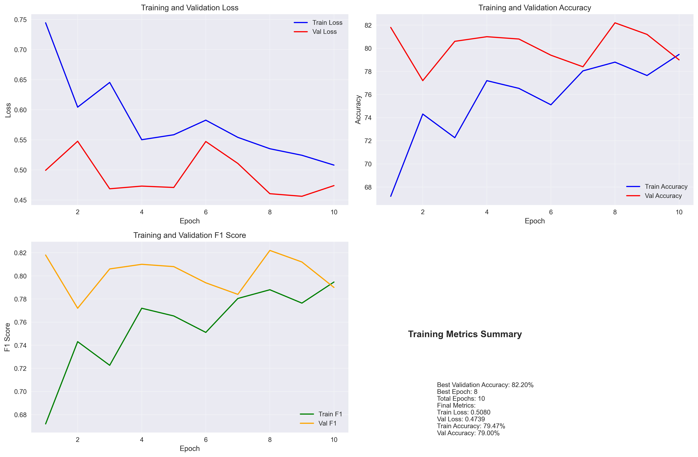
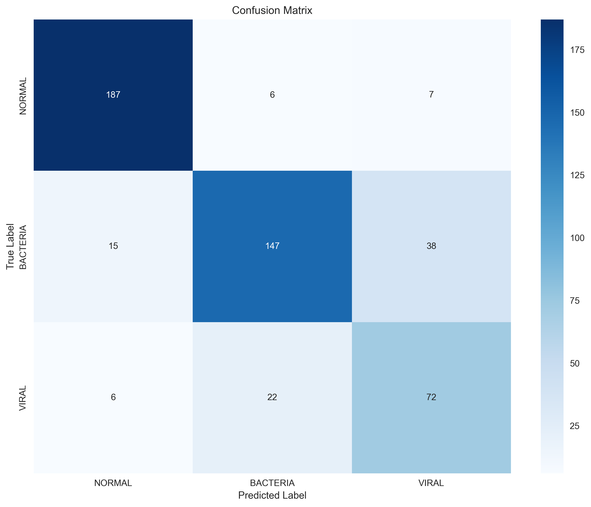

# Distinguishing Pneumonic From Healthy Lungs

In this project, we built a deep-learning system to assist medical professional in distinguishing healthy lungs from lungs infected with pneumonia. 

# Authors
[Intan K. Wardhani](https://github.com/intanwardhani) and [Sandrine Herbelet](https://github.com/Sandrine111222). 


# Table of Contents

- [Workflow](#workflow)  
- [Features](#features)  
- [Dataset](#dataset)  
- [Data preprocessing](#data-preprocessing)
- [Model evaluation](#model-evaluation)  
- [Usage](#usage)   
- [Project Structure](#project-structure)   


# Workflow

After proper preprocessing steps using OpenCV, taking into account the anture of the dataset itself and therefore only applying resizing wit area interpolation to preserve intensity, mild denoising to preserve structure, mild CLAHE to avoid over-amplification and normalization, we imported keras models. 
The output layer was adjusted to only contain 3 classes, since we have 3 classes to identify: pneumonia (bacterial or viral) or healthy.
After building our model, we trained them. The validation set was used to see what the actual accuracy might be. 
Once our model accuracy was sufficient, we tested on our testing set.
We plotted all the relevant evaluation metrics for our model (confusion matrix, ROC, precision/recall, validation accuracy,...).

# Features

- Pytorch is used as the backbone
- Mild preprocessing adapted to the nature of the data 
- Applying resizing, mild denoising 
- Work with pytorch resnet18 model 
- Train the model on a preprocessed training dataset
- Validate the model on the raw validation dataset  
- Test the the model on the raw testing dataset 
- Plot evaluation metrics

# Dataset

The X-ray dataset was downloaded from Kaggle:
https://www.kaggle.com/datasets/paultimothymooney/chest-xray-pneumonia


# Data preprocessing

X-rays require mild preprocessing before being used in a Convolutional Neural Network (CNN) primarily to standardize variability across different equipment and to enhance diagnostic features that might be subtle in raw digital formats.  

Raw X-rays can vary significantly in size (e.g., 3000 x 2000 pixels). CNNs require a fixed input dimension (commonly 224x224 or 512x512) for their fully connected layers. Digital radiography often contains "noise" from scattered radiation or electronic artifacts. Mild filters, such as Median or Gaussian filters, help suppress this without losing critical edge information.Techniques like CLAHE (Contrast Limited Adaptive Histogram Equalization) are frequently used to sharpen local contrast, making fine details like lung nodules or small fractures more visible to the network.


# Model evaluation

Training history over 10 epochs


Receiver operating characteristic (ROC) curve: a graphical representation of a classifier's performance across different thresholds


Confusion matrix: what the model predicts vs. what is true and how often it is correct/incorrect


# Usage

1. Set the environment variable before running any scripts in the terminal of the project root:
```bash
export PYTHONPATH="${PYTHONPATH}:$(pwd)"
```

2. Redistribute dataset to achieve balanced data counts for each split while preserving as much original data as possible. Run the following command in the terminal of the project root:
```bash
python src/data/redistribute_data.py --model_type resnet18
```

3. A new subfolder with the redistributed data should be created.

4. Check the training and evaluation workflow in `notebooks/model_experiments.ipynb`.

# Project Structure
```
pneumonia-detection-cnn/
├── README.md
├── requirements.txt
├── environment.yml
├── config.py
├── main.py
├── train.py
├── evaluate.py
├── predict.py
├── data/
│   ├── raw/
│   │   ├── chest_xray/
│   │   │   ├── train/
│   │   │   │   ├── NORMAL/
│   │   │   │   │   ├── img1.jpeg
│   │   │   │   │   └── img2.jpeg
│   │   │   │   └── PNEUMONIA/
│   │   │   │       ├── img3.jpeg
│   │   │   │       └── img4.jpeg
│   │   │   ├── val/
│   │   │   │   ├── NORMAL/
│   │   │   │   └── PNEUMONIA/
│   │   │   └── test/
│   │   │       ├── NORMAL/
│   │   │       └── PNEUMONIA/
│   ├── processed/
│   │   ├── train/
│   │   ├── val/
│   │   └── test/
│   └── external/
│       ├── additional_xrays/
│       └── metadata/
│           └── patient_info.csv
├── src/
│   ├── __init__.py
│   ├── data/
│   │   ├── __init__.py
│   │   ├── dataset.py
│   │   ├── transforms.py
│   │   └── utils.py
│   ├── models/
│   │   ├── __init__.py
│   │   ├── transfer_learning.py
│   │   ├── custom_cnn.py
│   │   └── model_factory.py
│   ├── training/
│   │   ├── __init__.py
│   │   ├── trainer.py
│   │   ├── loss_functions.py
│   │   └── metrics.py
│   ├── evaluation/
│   │   ├── __init__.py
│   │   ├── evaluator.py
│   │   ├── visualizations.py
│   │   └── metrics.py
│   └── utils/
│       ├── __init__.py
│       ├── logger.py
│       ├── helpers.py
│       └── config_parser.py
├── notebooks/
│   ├── data_exploration.ipynb
│   ├── model_experiments.ipynb
│   ├── visualization_analysis.ipynb
│   └── hyperparameter_tuning.ipynb
├── outputs/
│   ├── models/
│   │   ├── resnet18_pneumonia.pth
│   │   ├── resnet50_pneumonia.pth
│   │   └── densenet121_pneumonia.pth
│   ├── logs/
│   │   ├── training.log
│   │   └── validation.log
│   ├── results/
│   │   ├── confusion_matrix.png
│   │   ├── roc_curve.png
│   │   ├── training_history.png
│   │   └── classification_report.txt
│   ├── predictions/
│   │   ├── test_predictions.csv
│   │   └── sample_predictions.json
│   └── checkpoints/
│       ├── epoch_10.pth
│       └── epoch_20.pth
├── tests/
│   ├── __init__.py
│   ├── test_dataset.py
│   ├── test_models.py
│   ├── test_training.py
│   └── test_evaluation.py
├── docs/
│   ├── project_overview.md
│   ├── data_preprocessing.md
│   ├── model_architecture.md
│   ├── training_configuration.md
│   ├── evaluation_metrics.md
│   └── deployment_guide.md
├── scripts/
│   ├── download_data.sh
│   ├── preprocess_data.py
│   ├── train_model.sh
│   ├── evaluate_model.sh
│   └── clean_data.sh
├── config/
│   ├── default.yaml
│   ├── resnet18.yaml
│   ├── resnet50.yaml
│   └── densenet121.yaml
├── .gitignore
├── .gitattributes
├── Dockerfile
└── docker-compose.yml
```


